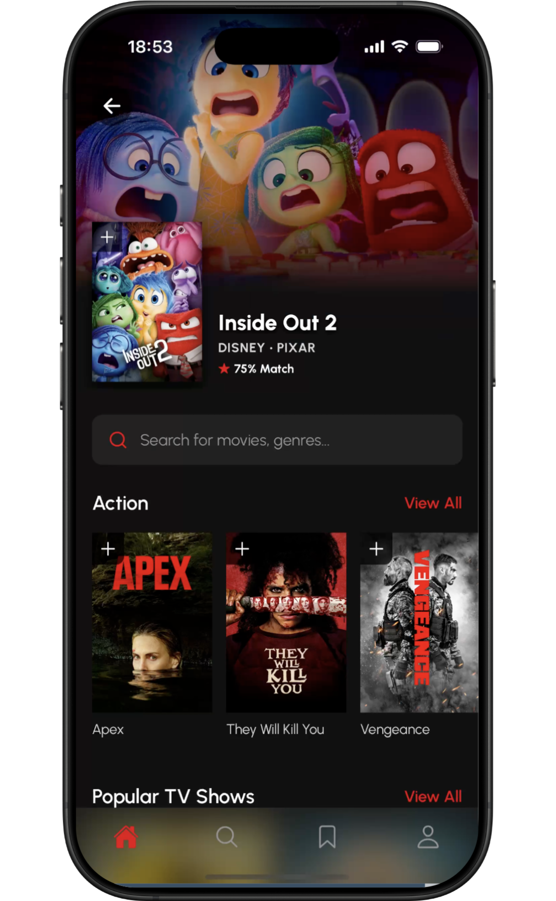
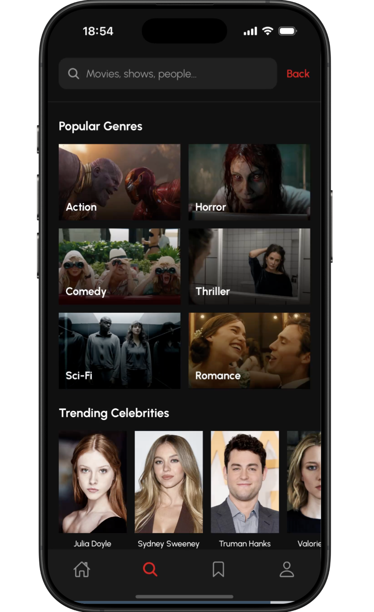
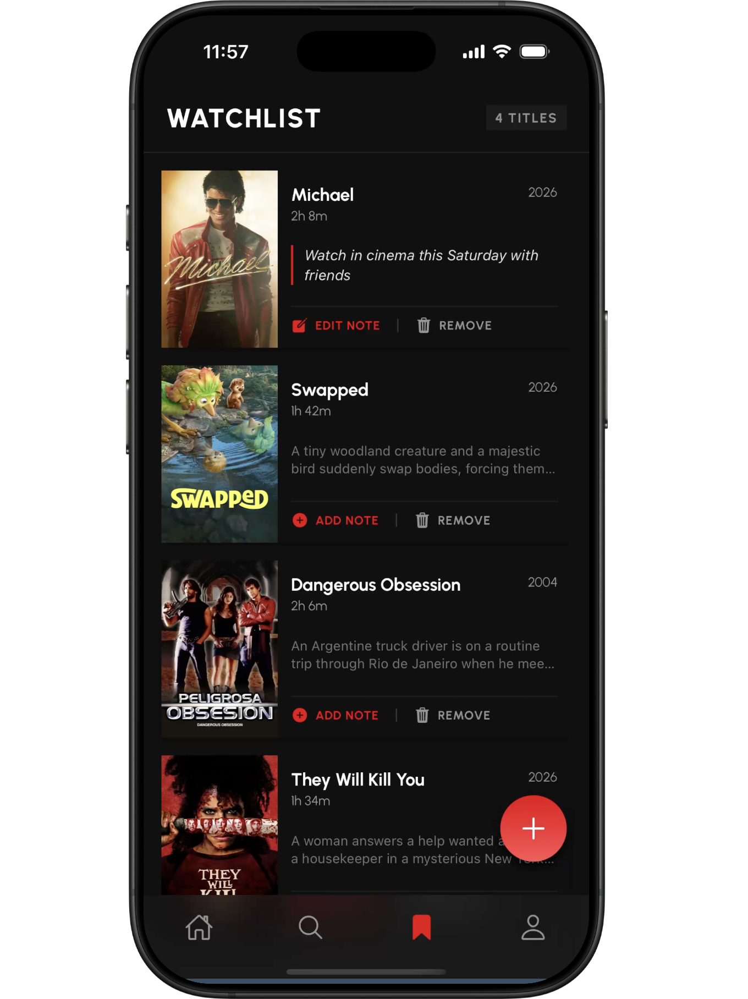
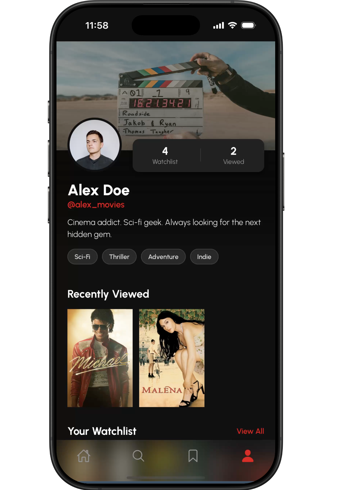
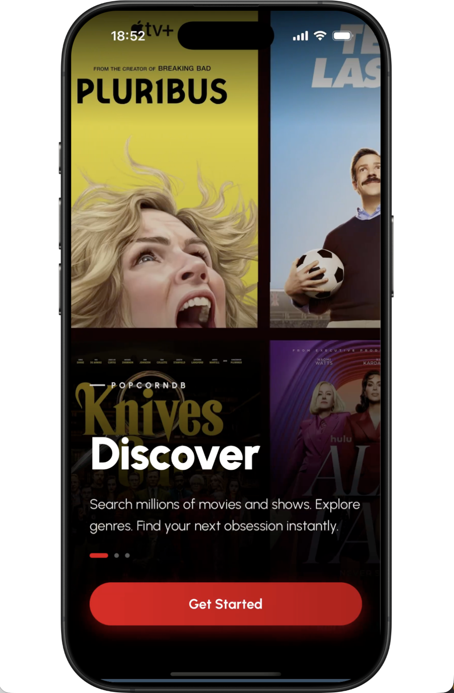

# 🎬 PopcornDB

PopcornDB is a React Native movie discovery app built with Expo.  
It allows users to browse trending content, search movies, view details, and save items to a personal watchlist using live data from the TMDB API.

---

## 🚀 Live Preview

👉 [Open in Expo Snack](https://snack.expo.dev/@natashahans/popcorndb-final-app-25002644)

> For the best experience, open on a mobile device using Expo Go.

---

## 📸 Screenshots

<p align="center">
  
  
</p>

<p align="center">
  
  
</p>

<p align="center">
  
</p>

---

## ✨ Features

- Browse trending movies and TV content  
- Search movies with filters  
- View detailed movie information  
- Save movies to a personal watchlist  
- Add personal notes to saved items  
- Track recently viewed content  
- Smooth carousel-based UI  

---

## 🛠 Tech Stack

- React Native  
- Expo  
- JavaScript  
- TMDB API  
- React Navigation  
- AsyncStorage  
- Expo Linear Gradient  

---

## 📂 Project Structure

```text
components/   Reusable UI components  
screens/      Main app screens  
context/      Watchlist state management  
constants/    Theme and styling  
api.js        API configuration  
